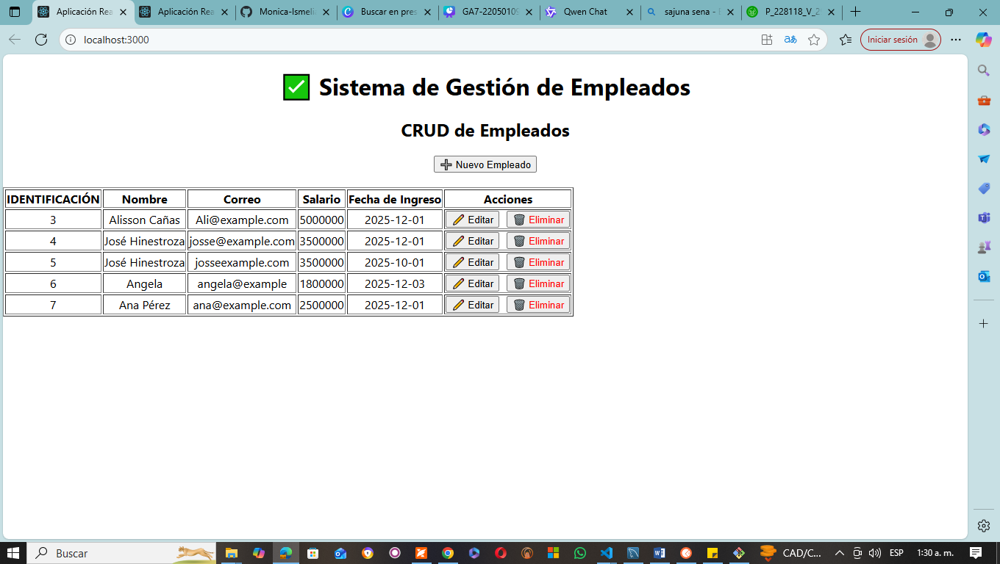
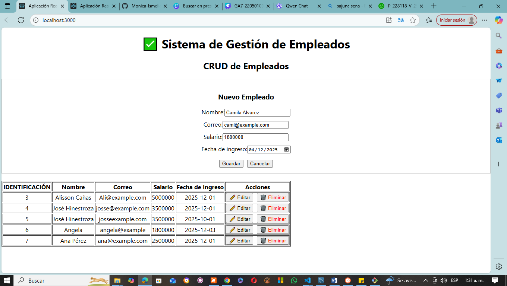

## 📌 Sistema de Gestión de Empleados (SGRH)
Proyecto Spring Boot + React

Aprendiz: Mónica Ismelia Cañas Reyes
Ficha: 2977425
Programa: Tecnólogo en Análisis y Desarrollo de Software

### 📘 Descripción del Proyecto

El Sistema de Gestión de Empleados (SGRH) es una aplicación web desarrollada para administrar la información del personal de una empresa.
Incluye un backend en Spring Boot conectado a MySQL y un frontend desarrollado en React.

El sistema permite realizar operaciones CRUD completas:

✔ Registrar empleados
✔ Listar empleados
✔ Editar información
✔ Eliminar registros

Este proyecto forma parte de la Evidencia GA7-220501096-AA4-EV03 – Módulos codificados y probados.

🏗️ Arquitectura del Sistema
┌──────────────────────┐
│      React.js        │  →  Interfaz web (Cliente)
└─────────▲────────────┘
          │ HTTP / JSON
┌─────────▼────────────┐
│    Spring Boot API   │  →  Lógica del negocio
└─────────▲────────────┘
          │ JPA / Hibernate
┌─────────▼────────────┐
│       MySQL          │  →  Base de datos
└──────────────────────┘

🛠️ Tecnologías Utilizadas
Backend

Java 17

Spring Boot 3.x

Spring Web

Spring Data JPA

Hibernate

MySQL Connector

Maven

Frontend

React.js

Fetch API / Axios

JSX

Hooks (useState, useEffect)

📋 Requisitos Previos

Antes de ejecutar el proyecto asegúrate de tener instalado:

✔ Java 17 o superior

✔ Node.js 18+

✔ MySQL Server

✔ Maven 3.8+

✔ Navegador web (Chrome/Opera/Edge)

# ⚙️ Instalación y Configuración
🟦 1. Backend – Spring Boot
1.1. Clonar el repositorio
git clone https://github.com/Monica-Ismelia/gestion-empleados--GA7-220501096-AA4-EV03
git clone https://github.com/Monica-Ismelia/GA7-220501096-AA3-EV02-gestion-empleados

1.2. Crear la base de datos

En MySQL ejecuta:

CREATE DATABASE empresa;

La tabla se crea automáticamente con Hibernate si tienes spring.jpa.hibernate.ddl-auto=update.

1.3. Configurar Application.properties

Ruta:

src/main/resources/application.properties

Contenido:

spring.datasource.url=jdbc:mysql://localhost:3306/empresa?useSSL=false
spring.datasource.username=TU_USUARIO
spring.datasource.password=TU_PASSWORD

spring.jpa.hibernate.ddl-auto=update
spring.jpa.show-sql=true
spring.jpa.properties.hibernate.format_sql=true

server.port=8080

1.4. Ejecutar el backend
mvn spring-boot:run

🟩 2. Frontend – React
2.1. Instalar dependencias

Desde la carpeta del frontend:

npm install

2.2. Ejecutar en modo desarrollo
npm start

La app se abrirá en:

👉 http://localhost:3000

Asegúrate de que el backend esté corriendo en http://localhost:8080

🚀 Uso del Sistema

Una vez corriendo ambos servidores, podrás:

✔ Listar todos los empleados
✔ Registrar un nuevo empleado
✔ Editar la información
✔ Eliminar un empleado
✔ Formulario de validación
✔ Actualización automática de la tabla
🔗 Endpoints del Backend (API REST)
Método	Endpoint	Descripción
GET	/api/empleados	Lista todos los empleados
POST	/api/empleados	Crea un nuevo empleado
PUT	/api/empleados/{id}	Actualiza un empleado
DELETE	/api/empleados/{id}	Elimina un empleado
🖼️ Capturas de Pantalla

  

🧪 Pruebas Realizadas

✔ Pruebas de integración Backend
✔ Pruebas de consumo API desde React
✔ Validación de formulario
✔ Pruebas de eliminación segura
✔ Manejo de errores y mensajes informativos

📝 Autor

Mónica Ismelia Cañas Reyes
Evidencia :Componente front-end del proyecto formativo y proyectos de clase (listas de chequeo) GA7-220501096-AA4-EV03
Aprendiz SENA – ADSO
Ficha 2977425

